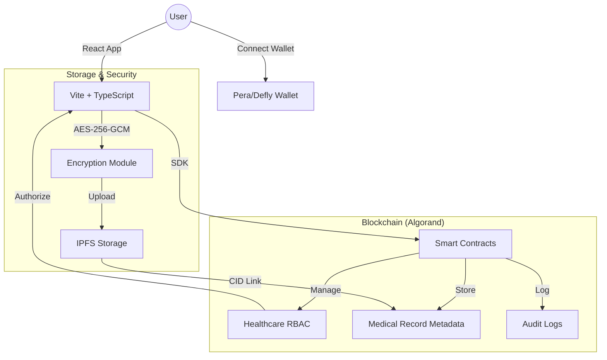

<div align="center">
  
  <h1>Ojasraksha</h1>
  <p><strong>Decentralized, DPDP-Compliant Healthcare Management System</strong></p>
  <p>
    
    
    
    
  </p>
</div>

---

## 🌟 Overview

**Ojasraksha** (vitality protection) is a next-generation healthcare platform designed to empower patients with full control over their medical data while ensuring strict compliance with India's **Digital Personal Data Protection (DPDP) Act**. 

Built on the **Algorand Blockchain**, Ojasraksha provides immutable audit trails, secure decentralized storage via **IPFS**, and a robust Role-Based Access Control (RBAC) system to bridge the gap between patient privacy and healthcare efficiency.

## ✨ Implemented Features

### 🔐 Multi-Role Ecosystem
Ojasraksha features 8 specialized dashboards tailored to the healthcare lifecycle:
- **Patient Portal**: Full ownership of health records, consent management, and unified health profile.
- **Doctor Dashboard**: Secure patient history access (consent-based) and on-chain prescription issuance.
- **Hospital Portal**: Facility management, staff registration, and role assignment.
- **Lab Dashboard**: End-to-end secure file lifecycle—encrypting results at source and anchoring to Alogrand.
- **Pharmacy Dashboard**: Real-time prescription queue for efficient medication fulfillment.
- **Insurance Portal**: Transparent claim verification and policy management based on verified records.
- **Auditor Dashboard**: Independent oversight through immutable on-chain audit logs.
- **Admin Dashboard**: System-level configuration and high-level health network monitoring.

### 🛡️ Core Processes & Innovations
- **Auto-Funding Mechanism**: New users are automatically funded with 3 ALGO to ensure immediate usability on the blockchain.
- **Secure File Lifecycle**: Sensitive medical files (PDFs/Images) are encrypted using **AES-256-GCM** before being uploaded to IPFS.
- **Immutable Audit Trails**: Every data access event is logged on-chain, ensuring 100% transparency for Data Fiduciaries.
- **Pera Wallet Integration**: Stabilized wallet connections with custom polyfills for a seamless user experience.

## 🏗️ Technical Architecture



## 🛠️ Tech Stack & Requirements

### Tech Stack
- **Blockchain**: Algorand (Python/AlgoKit/TEAL)
- **Frontend**: React 18, TypeScript, Tailwind CSS, daisyUI, Framer Motion
- **Wallet**: Pera Wallet, Defly, Exodus (via @txnlab/use-wallet)
- **Storage**: IPFS
- **Encryption**: Crypto Web API (AES-256-GCM)

### Prerequisites
- **Node.js**: v20.0 or higher
- **AlgoKit**: Latest version ([Installation Guide](https://github.com/algorandfoundation/algokit-cli#install))
- **Docker**: Required for running LocalNet
- **Python**: v3.12 or higher (for contract development)

## 🚀 Getting Started

### 1. Repository Setup
```bash
git clone https://github.com/Yashwanth112004/Ojasraksha.git
cd ojasraksha
```

### 2. Infrastructure Setup (LocalNet)
Start the Algorand LocalNet environment:
```bash
algokit localnet start
```

### 3. Smart Contract Deployment
```bash
cd projects/ojasraksha-contracts
algokit project run build # Compiles Python to TEAL
algokit project deploy localnet # Deploys contracts to local node
```

### 4. Frontend Configuration
Ensure you have the required `.env` variables. Copy the template:
```bash
cd ../ojasraksha-frontend
cp .env.template .env
```
Update `.env` with your IPFS credentials if using a remote provider.

### 5. Launch the Application
```bash
npm install
npm run dev
```

## 🌍 Project Structure

| Path | Description |
| --- | --- |
| `projects/ojasraksha-contracts` | Python-based smart contracts for RBAC and Records. |
| `projects/ojasraksha-frontend` | React frontend with role-specific dashboards. |
| `docs` | Architectural diagrams and project assets. |

---

<p align="center">Built with ❤️ for a healthier, decentralized future.</p>


